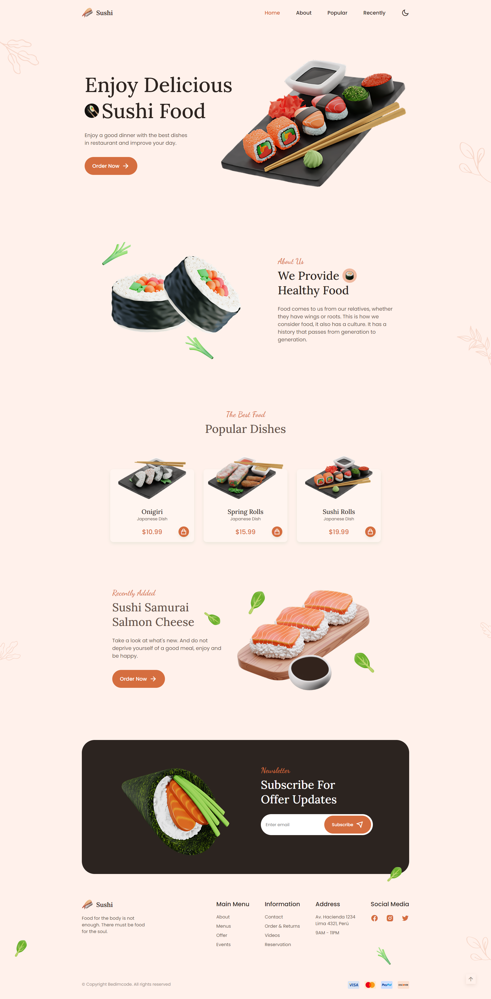

# FR09 Responsive Sushi Website

Original: [Responisve Sushi Website | Bedimcode](https://youtu.be/HW1zt2EPMqY)

|                     Goal                     | Do                                           |
| :------------------------------------------: | -------------------------------------------- |
|  |  |
|               Date: 21.11.2022               | Time: **~8h**                                |

### Features

- Fully responsive: animated menu, layout changes, multiple breakpoints.

- Dark / light mode switch.

- Customized scrollbar.
- Developed first with the Mobile First methodology, then for desktop.
- Scroll-to-top button.

| Mobile menu            | Dark mode               |
| ---------------------- | ----------------------- |
|  |  |

## Lessons learned

* Sushi image at the top is interesting.

  * positioned absolutely
  * stuck to the right:0
  * centered vertically via top:50% + translateY(-50%)
  * scaled to overflow container
  * no cut because of padding of nearest relatively-positioned parent

  