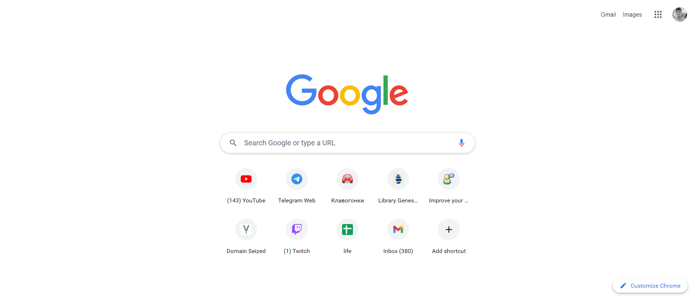

# FR10 Google Start Page

Just wondering - how time would it take me to implement page similar to my google start page?

Tried to balance speed, accuracy and code quality (in that order).

Both me and my girlfriend mixed up original and my implementation, so goal is reached.

|                       Goal                       | Do                                               |
| :----------------------------------------------: | ------------------------------------------------ |
|  |  |
|                 Date: 22.11.2022                 | Time: **1h30min**                                |

### Features

- Menu dropdown with customized scrollbar

## Lessons learned

* Apps button and profile icon hover implemented by ::after rounded div.
* Blue pencil implemented by mask-image + blue background-color