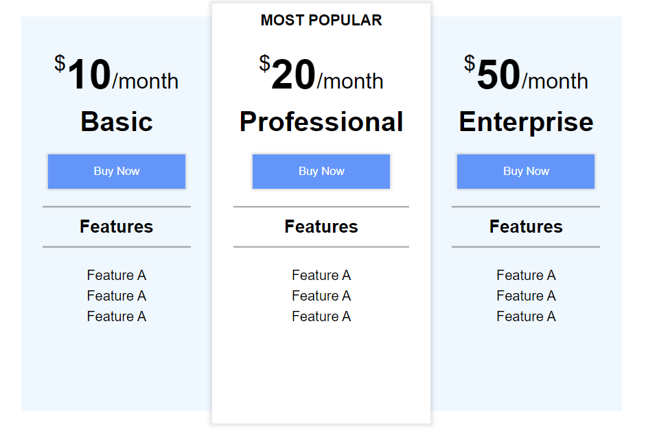

# Frontend Path

Mastering HTML+CSS by doing 50 live-coding youtube projects. 

Before watching solution, I'm trying implement it by myself as fast as possible. 

| Date           | Project                                                      | Result                                                       | Timing |
| -------------- | ------------------------------------------------------------ | ------------------------------------------------------------ | ------ |
| 02.09.2022 (1) | [Price Comparison Page](fr02_HTML-CSS-Price-Comparison-Table) Source: [Web Dev Simplified](https://youtu.be/M_bhZEY6_kM?t=20) |  | 46min  |
|                |                                                              |                                                              |        |

