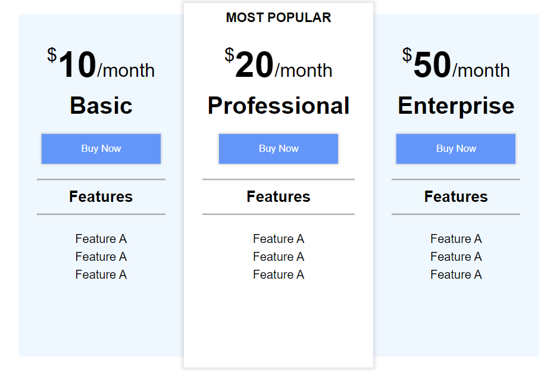
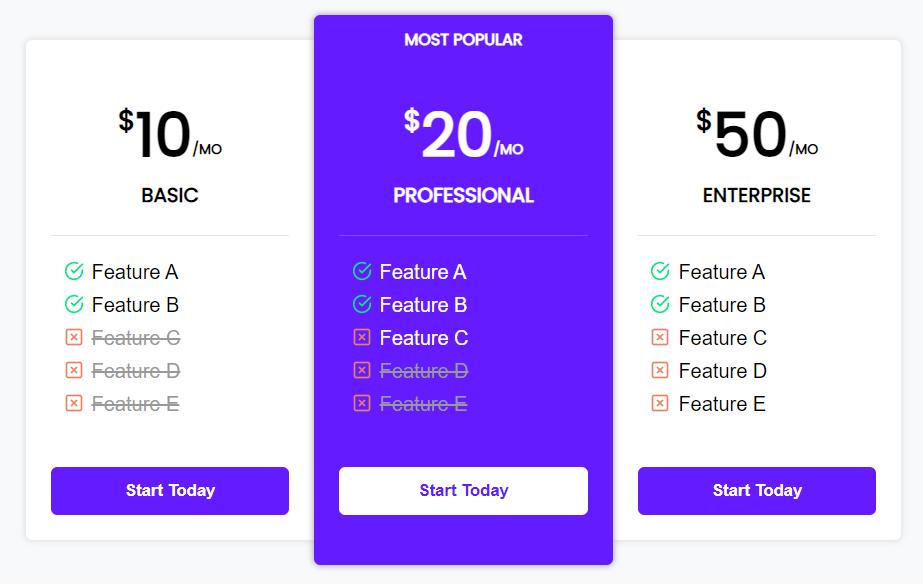

# Frontend Path

Mastering HTML+CSS by doing 50 live-coding youtube projects. 

1. Do: Implement the solution by myself as fast as possible. 
2. Watch the video.
3. Redo: Repeat the solution as it was done in the video without peeking.

| Date                | Project                                                      | Do                                                           | Redo                                                         |
| ------------------- | ------------------------------------------------------------ | ------------------------------------------------------------ | ------------------------------------------------------------ |
| 01  02.09.2022 | [Price Comparison Page](fr02_HTML-CSS-Price-Comparison-Table) Source: [Web Dev Simplified](https://youtu.be/M_bhZEY6_kM?t=20) |  Timing: **46min** |  Timing: **54min** |
|                     |                                                              |                                                              |                                                              |

