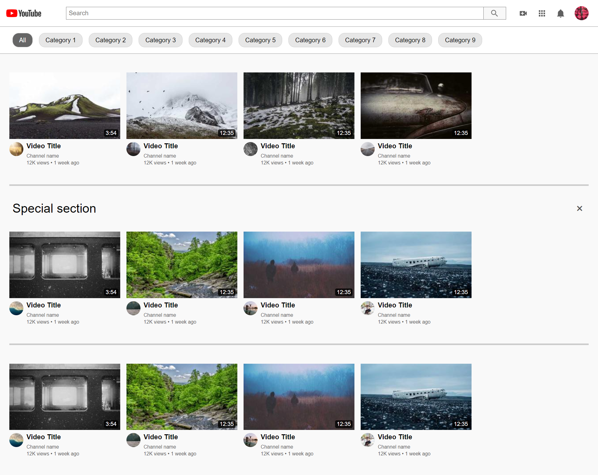
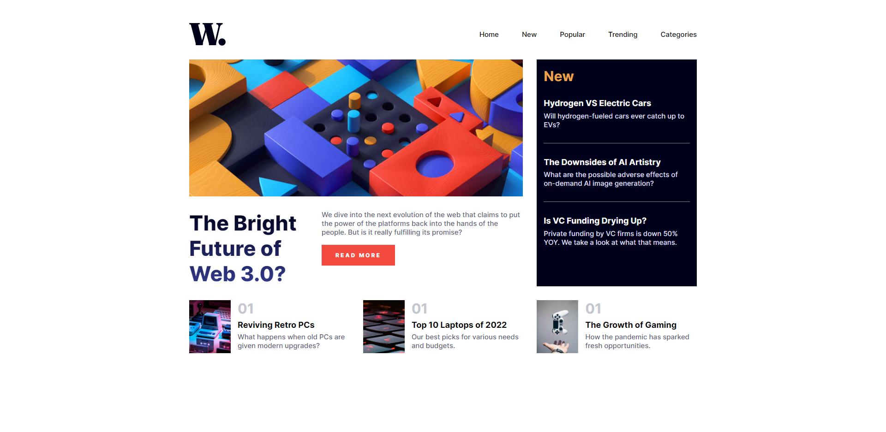
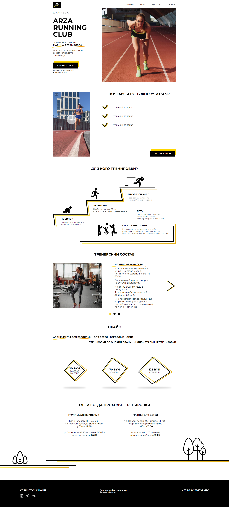
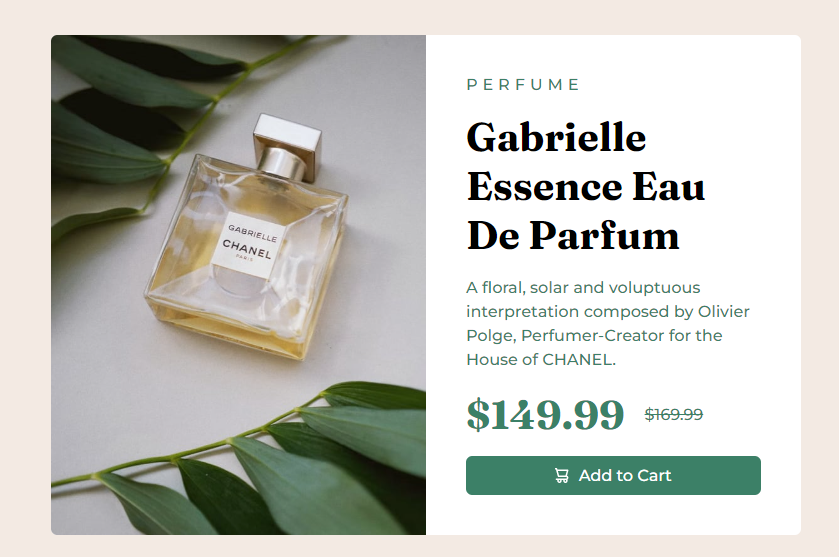
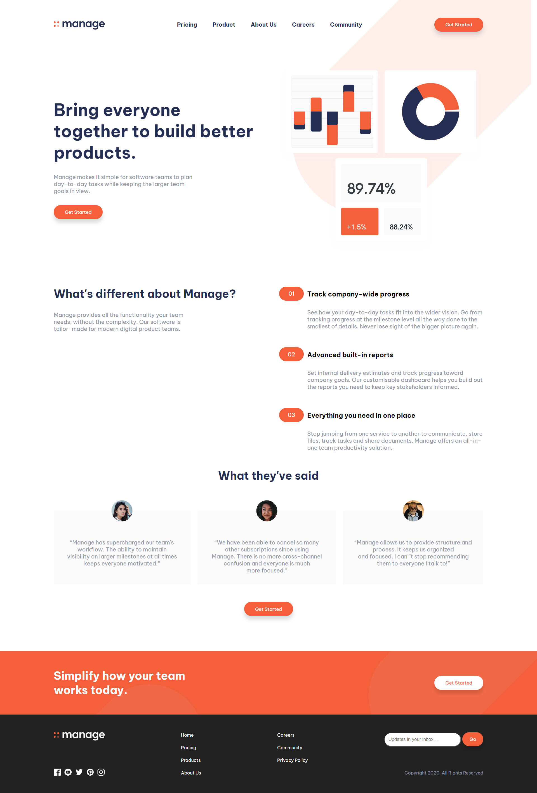
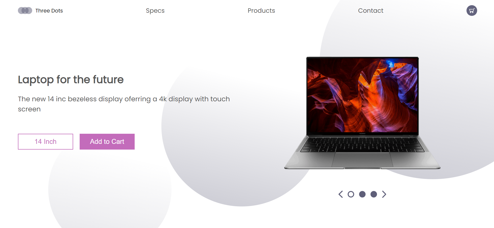

# Frontend Path

Mastering HTML+CSS by doing 50 live-coding youtube projects. 

1. **Do**: Implement the solution by myself as fast as possible. 
2. Watch the video.
3. **Redo**: Repeat the solution as it was done in the video without peeking.

| No. Date            | Project                                                      | Time        | Result                                                       | Demo                                                         |
| ------------------- | ------------------------------------------------------------ | ----------- | ------------------------------------------------------------ | ------------------------------------------------------------ |
| 10 22.11.2022  | [Google Start Page](fr10_goolge_start_page)                  | **1h30min** |  | [live demo](https://zoxal.github.io/frontend-path-50/fr10_goolge_start_page/do/) |
| 09 21.11.2022  | [Responsive Sushi Website](fr09_responsive-sushi-website)    | **~8h**     |  | [live demo](https://zoxal.github.io/frontend-path-50/fr09_responsive-sushi-website/do/) |
| 08 10.11.2022  | [Youtube Clone](fr08_youtube_clone)                          | **~3h**     |  | [live demo](https://zoxal.github.io/frontend-path-50/fr08_youtube_clone/do/) |
| 07 10.11.2022  | [News homepage](fr07_new_homepage_main)                      | **~6h**     |  | [live demo](https://zoxal.github.io/frontend-path-50/fr07_news_homepage_main/do/) |
| 06 07.11.2022  | [Arza running club](fr06_arza)                               | **~5h**     |        | [live demo](https://mich.life/frontend-path-50/fr06_arza/)   |
| 05 18.09.2022  | [FrontendMentor: Socal proof section](fr05_fm_social_proof_section) | **1h57min** |  | [live demo](https://zoxal.github.io/frontend-path-50/fr05_fm_social_proof_section/do) |
| 04 14.09.2022  | [FrontendMentor: Perfume product preview](fr04_fm_product_preview) | **1h22min** |  | [live demo](https://zoxal.github.io/frontend-path-50/fr04_fm_product_preview/do) |
| 03  04.09.2022 | [FrontendMentor: Manage Landing](fr03_fm_manage_landing_orange) | **2h42min** |  | [live demo](https://zoxal.github.io/frontend-path-50/fr03_fm_manage_landing_orange/do) |
| 02  03.09.2022 | [Laptop Lading](fr02_laptop_landing)                         | **49min**   |  | [live demo](https://zoxal.github.io/frontend-path-50/fr02_laptop_landing/do) |
| 01  02.09.2022 | [Price Comparison Page](fr01_HTML-CSS-Price-Comparison-Table) | **46min**   |  | [live demo](https://zoxal.github.io/frontend-path-50/fr01_HTML-CSS-Price-Comparison-Table/do) |

