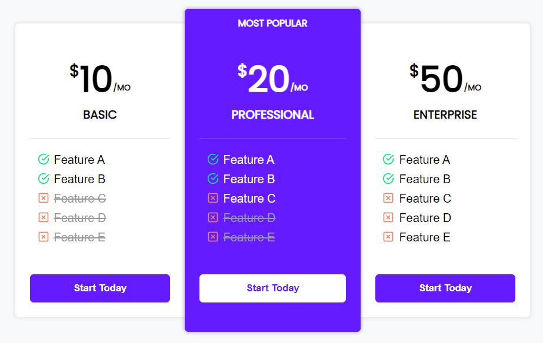

# Frontend Path

Mastering HTML+CSS by doing 50 live-coding youtube projects. 

1. **Do**: Implement the solution by myself as fast as possible. 
2. Watch the video.
3. **Redo**: Repeat the solution as it was done in the video without peeking.

| Date                | Project                                                      | Do                                                           | Redo                                                         |
| ------------------- | ------------------------------------------------------------ | ------------------------------------------------------------ | ------------------------------------------------------------ |
| 03  04.09.2022 | Folder: [FrontendMaster: Manage Landing](fr03_fm_manage_landing_orange) Source: [Kevin Powell](https://www.youtube.com/watch?v=h3bTwCqX4ns) |   Timing: **2h42min** | -                                                            |
| 02  03.09.2022 | Folder: [Laptop Lading](fr02_laptop_landing) Source: [Dev Ed](https://www.youtube.com/watch?v=ZeDP-rzOnAA) |   Timing: **49min** |  |
| 01  02.09.2022 | Folder: [Price Comparison Page](fr02_HTML-CSS-Price-Comparison-Table) Source: [Web Dev Simplified](https://youtu.be/M_bhZEY6_kM?t=20) |   Timing: **46min** |   Timing: **54min** |

